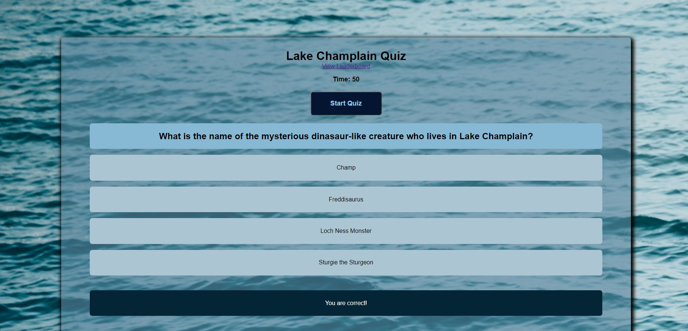

# 04 Web APIs: Code Quiz - Lake Champlain

## App Objective

The objective of this project is to demonstrate my ability to code both multiple-choice questions and an interactive leaderboard. 

This timed coding quiz has multiple-choice questions. The app runs in the browser and features dynamically updated HTML and CSS powered by JavaScript code. It features a clean, polished, and responsive user interface. 

## User Story

```
AS A  website visitor
I WANT to take a timed quiz about Lake Champlain that stores high scores
SO THAT I can gauge my progress compared to others
```

## Key Features

```
* A start button
* A timer counts down from 60 to 0
* Score calculation
* Feedback on user selections
* An interactive leaderboard

```
## Pseudo Code

* a timer counts down from 60 seconds to 0 when start quiz button is clicked
* quiz begins (question presented) when "start quiz" button is clicked
* time (5 seconds) is subtracted from the clock for each incorrect answer
* user does not advance to the next question until a correct answer is selected
* user receives feedback for correct and incorrect selections
* quiz stops when all questions are answered or timer reaches zero seconds remaining
* user receives feedback that time is up if they run out of time before answering all questions
* score = remaining seconds 
* user can save initials and score at the end of the game (leaderboard)
* user can clear the leaderboard (delete scores and initials)
* from leaderboard user can restart quiz
* from leaderboard page user can return to homepage


## Screen Capture

The following shows the visual display and functionality of the quiz:




## Deployed application

The URL of the deployed application.
https://ndaruwalla.github.io/code-quiz/

## GitHub repository

The URL of the GitHub repository that contains my code.
https://github.com/NDaruwalla/code-quiz/


---

© 2021 Trilogy Education Services, LLC, a 2U, Inc. brand. Confidential and Proprietary. All Rights Reserved.
